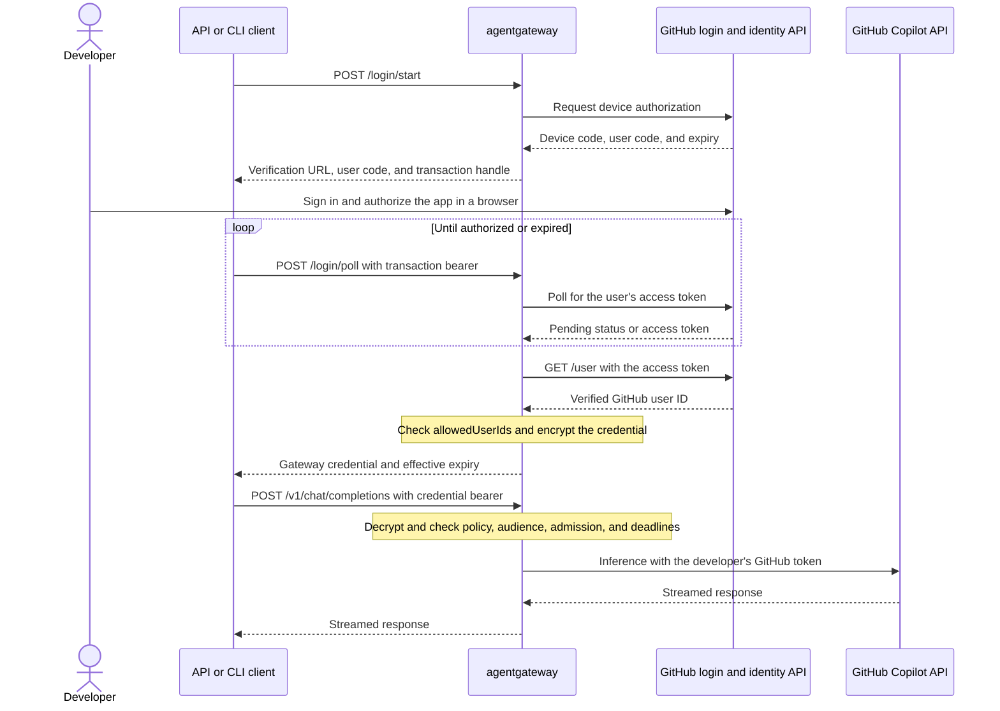

# WIP: Shared agentgateway access to Copilot

This branch is a prototype for discussing shared Copilot access with the working group before opening an implementation PR. It includes native authentication and Kubernetes controller support. The final native flow still needs successful live validation. See [Validation](#validation) for the recorded results and remaining work.

## Design

Each developer signs in with GitHub through agentgateway. GitHub issues the user's access token, and the gateway wraps it in an encrypted credential that the client holds and presents on later requests. The Copilot backend then calls GitHub Copilot using that developer's token.

Login runs inside agentgateway through direct HTTP calls. There is no separate login service or Copilot SDK runtime. GitHub still decides whether the user's token can access Copilot and the requested model.



The client sends the transaction handle as `Authorization: Bearer <transaction>` while polling. After login succeeds, it uses `Authorization: Bearer <credential>` for inference. Login responses include `Cache-Control: no-store`. Shared access requires TLS terminating at agentgateway. Plain HTTP is allowed only for direct loopback connections.

### Credentials and expiration

The credential is an AES-256-GCM encrypted envelope containing the GitHub access token, verified numeric user ID, policy identity, audience, and applicable deadlines. The operator supplies a persistent 32-byte encryption key through a protected file in standalone mode or a Kubernetes Secret in Gateway mode.

There is no persistent per-user credential database. Pending device logins live in bounded, expiring process memory, and GitHub tokens exist transiently during login and request handling. After issuance, the client holds the encrypted credential. Anyone with a copy can replay it while it remains valid.

The operator chooses a positive `credentialTTL` or explicitly sets `disableExpiry: true`. There is no fixed one-hour lifetime. The earliest gateway or GitHub deadline applies, and disabling gateway expiry never extends GitHub's token lifetime. If neither side supplies a deadline, the credential has no scheduled expiration, though GitHub can still revoke the underlying token. Automatic refresh is deferred, and refresh tokens returned by GitHub are discarded. Expiration requires another login.

Current admission and deadlines are checked again before each upstream dispatch, including retries. The `copilotUser` backend uses the verified request identity and rejects incompatible destinations or authentication settings. It does not fall back to the gateway host's credentials.

### Users and organizations

Admission currently uses `allowedUserIds`. The example permits only `iandvt`, GitHub user ID `25870869`. Operators can list users from different organizations, subject to each user's GitHub and Copilot permissions. Owning or registering the app in an organization does not restrict who can sign in.

Organization membership checks are not implemented. Separate policies, audiences, and keys provide configuration boundaries, but this branch has no organization directory or tenant administration. Live testing across organizations remains outstanding.

### API, CLI, and Gateway mode

A compatible client needs a configurable gateway endpoint, bearer credential, and support for the gateway's request and response format. The proof uses Python and curl with streamed chat completions. A coding CLI would obtain the credential through the same login flow, then supply it through that client's supported credential configuration. Tool execution and compatibility with a specific coding CLI still need testing.

Standalone configuration attaches the Copilot policy to the route and selects `backendAuth: copilotUser`. In Kubernetes, the branch adds the Copilot provider to `AgentgatewayBackend`, route authentication through `AgentgatewayPolicy.traffic.copilot`, and per-user backend authentication through `AgentgatewayPolicy.backend.auth.copilotUser`. The controller resolves the encryption Secret and sends the configuration through xDS. See [kubernetes.yaml](kubernetes.yaml) for a single-replica example.

Keeping the same key and compatible policy configuration lets a restarted instance decrypt an existing credential. Future replicas accepting those credentials would each need that key and matching configuration. Login transactions currently belong to one process, so replica routing needs a separate decision. Multiple replicas are outside this baseline.

## Open Questions

- **Refresh:** Is requiring another login enough for the first version? Automatic refresh needs a decision about refresh-token handling, concurrent clients, and replacing credentials already held by clients.
- **Revocation:** Removing a user from the current allowlist blocks their credentials when the updated policy is used. Revoking one session while preserving that user's other sessions needs additional state or an online check.
- **Organization admission:** Should optional organization restrictions complement explicit user allowlists? Membership visibility, SSO requirements, and policy updates need testing with the organizations that will use this.
- **Lifetime and keys:** The prototype leaves gateway expiration to the operator. We need agreement on configuration guidance and a future key-rotation mechanism, including how replicas receive keys.
- **GitHub integration:** Which app ownership, permissions, and direct HTTP API contract should the project support? The prototype requests `read:org`, although current admission only checks `/user`.
- **Client contract:** Agree on the login endpoints and how CLI clients obtain and retain the encrypted credential. Pick a coding CLI for the next live test.

## Run the standalone proof

The gateway handles login and inference on the route with the Copilot policy. A separate `/health` route returns HTTP 200 without authentication. Run the commands below from this worktree's root.

Build the standalone gateway and run synthetic native tests:

```bash
cargo +1.98.0 build --offline --locked -p agentgateway-app --no-default-features --features crypto-aws-lc
python3 examples/copilot-multi-tenant-proof/proof.py --mock
```

`--mock` runs the Rust library's `copilot` tests. It starts no synthetic issuance endpoint. The test runner reports the command, exit code, and nonzero test count. Credential, expiry, policy isolation, and backend dispatch checks belong in those native tests.

Start a disposable loopback gateway and request a fresh device login:

```bash
python3 examples/copilot-multi-tenant-proof/proof.py --live
# Alternatively, impose a five-minute gateway credential lifetime:
python3 examples/copilot-multi-tenant-proof/proof.py --live --ttl 5m
```

Authorize the registered app as iandvt when the runner displays GitHub's verification URL and user code. The generated policy admits GitHub user ID `25870869`. The runner checks unauthenticated health and rejection of missing inference credentials, then verifies complete streamed responses through Python and curl. In a local run, it restarts the gateway with the same key and repeats Python inference using the credential still in memory. It then replaces its temporary key, restarts again, and checks that the old credential receives HTTP 401. Curl receives the encrypted credential through standard input. Neither client prints the access token, encrypted credential, refresh token, transaction handle, or encryption key.

The standalone listener is `http://127.0.0.1:18765`, and its configured audience is that exact origin. Its raw 32-byte encryption key lives in a temporary directory with mode `0700`, in a file with mode `0600`. The runner keeps the key through the first restart and removes its temporary files when the run ends. Each invocation starts with a new key. Choose a lifetime long enough for three streamed responses and two restarts. `--ttl` defaults to `none`, which sets `disableExpiry: true`; a known GitHub expiration still applies. Positive whole durations such as `30s`, `5m`, `1h`, and `1d` set `credentialTTL`.

To use an already configured HTTPS gateway, supply its origin and, when necessary, its issuing CA certificate:

```bash
python3 examples/copilot-multi-tenant-proof/proof.py --live \
  --base-url https://copilot.local.test:8443 \
  --ca-file /absolute/path/to/copilot-ca.crt
```

This mode starts no gateway and changes no policy. Restart checks are skipped and recorded as `null`. Configure its `audience` to match the URL, including the port. The gateway must expose `/health`, `/login/start`, `/login/poll`, and `/v1/chat/completions` as in the example. TLS certificate and hostname verification remain enabled. Set lifetime and admission in the existing gateway's policy; `--ttl` applies only to a process started by the runner. Both live modes send inference only through the native provider's fixed GitHub Copilot HTTPS destination.

## Kubernetes preparation

[kubernetes.yaml](kubernetes.yaml) defines a `Gateway`, two `HTTPRoute` resources, a Copilot `AgentgatewayBackend`, and their policies. `AgentgatewayParameters.spec.deployment.spec.replicas: 1` sets one data-plane replica, with `Recreate` deployment updates to avoid two simultaneous replicas. The Gateway uses HTTPS. The normal health route has its own direct-response policy.

The example references two operator-created Secrets in `copilot-proof`: `copilot-tls`, containing a certificate for `copilot.local.test` and its private key, and `copilot-encryption`, whose `key` entry contains exactly 32 raw bytes. Keep the encryption Secret stable across gateway restarts. No Secret values are included here. The example's audience is `https://copilot.local.test:8443`, matching the client URL below. For another endpoint, update both values together.

Tool inspection on September 15, 2026 found `kubectl`, `helm`, and `podman` through mise, with a running Podman machine; `docker` was absent. The repository's `tools/kind` wrapper runs the Go kind tool. The existing controller e2e harness is `controller/hack/run-e2e-test.sh`; its setup targets also install unrelated components and use implicit Kubernetes contexts. The commands here name a separate disposable cluster and an isolated kubeconfig explicitly.

Preparation requires working Rust 1.98 and Go 1.27 toolchains, a container runtime, and generated Copilot protobuf and CRD artifacts. The repository Dockerfile builds the UI with pnpm. On a Microsoft-managed machine, configure container package access with the `cfs` skill before building that image. Do not run its package installation against an alternate public registry. The commands below assume that package routing preparation is complete.

Build both images from this checkout. These commands prepare local images and do not deploy them:

```bash
podman build -t localhost/copilot-proof/agentgateway:native \
  --build-arg VERSION=copilot-native \
  --build-arg GIT_REVISION="$(git rev-parse HEAD)" .
GOTOOLCHAIN=go1.27.0 make -C controller agentgateway-controller GOARCH=arm64 VERSION=v0.0.0-copilot-native
podman build --platform linux/arm64 --build-arg GOARCH=arm64 \
  -f controller/cmd/agentgateway/Dockerfile.agentgateway \
  -t localhost/copilot-proof/controller:native controller/_output/pkg/agentgateway
```

The controller command targets this Mac's ARM64 Podman machine. Use `amd64` consistently for both controller build arguments on an AMD64 host. Review the manifests and both images before requesting deployment approval.

Both Linux ARM64 images were built locally on September 15, 2026. The controller used the commands above. The data plane used a separate local recipe with Rust `1.98.0-trixie` and `cargo build --locked -p agentgateway-app --no-default-features --features crypto-aws-lc,jemalloc --profile ci`. That build excludes the UI and invokes neither npm nor pnpm. Each image passed `podman run --rm --network none <image> --version` with exit `0` and reported `v0.0.0-copilot-native`.

| Image | Verified image ID |
| --- | --- |
| `localhost/copilot-proof/controller:native` | `2672532cc51234c8dee8cb1c307b6cedc1431ce1ff6087c9c5d44c9b8b77bb50` |
| `localhost/copilot-proof/agentgateway:native` | `e41b96a2d88c4016634dddf3091c85dfe9ca901d0d8f9ddeb557927ec54649f6` |

Local build recipes, logs, and source snapshots are in `/tmp/copilot-native-container/`. The credential-free record is also retained at `target/copilot-proof/image-build-evidence.json`. All 997 recorded data-plane source files and 299 controller source files matched their build snapshots after compilation. The temporary VM swap used during compilation was disabled and removed. No cluster was created or modified.

## Kubernetes execution after deployment approval

Run these commands only after approval to create and use the disposable cluster. Choose a new cluster name and a new kubeconfig path. No command below selects an existing tenant cluster.

```bash
export COPILOT_CLUSTER=copilot-native-proof
export COPILOT_CONTEXT="kind-${COPILOT_CLUSTER}"
export COPILOT_KUBECONFIG="$PWD/target/copilot-proof/kubeconfig"
mkdir -p target/copilot-proof
KIND_EXPERIMENTAL_PROVIDER=podman GOTOOLCHAIN=go1.27.0 tools/kind create cluster \
  --name "$COPILOT_CLUSTER" --kubeconfig "$COPILOT_KUBECONFIG" \
  --image kindest/node:v1.36.1@sha256:3489c7674813ba5d8b1a9977baea8a6e553784dab7b84759d1014dbd78f7ebd5
KIND_EXPERIMENTAL_PROVIDER=podman GOTOOLCHAIN=go1.27.0 tools/kind load docker-image \
  --name "$COPILOT_CLUSTER" localhost/copilot-proof/agentgateway:native localhost/copilot-proof/controller:native
kubectl --kubeconfig "$COPILOT_KUBECONFIG" --context "$COPILOT_CONTEXT" apply --server-side \
  -f https://github.com/kubernetes-sigs/gateway-api/releases/download/v1.6.1/experimental-install.yaml
export COPILOT_ISTIO_MODULE="$(GOTOOLCHAIN=go1.27.0 go list -m -f '{{.Dir}}' istio.io/istio)"
test -n "$COPILOT_ISTIO_MODULE"
kubectl --kubeconfig "$COPILOT_KUBECONFIG" --context "$COPILOT_CONTEXT" apply --server-side \
  -f "$COPILOT_ISTIO_MODULE/manifests/charts/base/files/crd-all.gen.yaml"
helm --kubeconfig "$COPILOT_KUBECONFIG" --kube-context "$COPILOT_CONTEXT" upgrade --install \
  agentgateway-crds controller/install/helm/agentgateway-crds \
  --namespace agentgateway-system --create-namespace
helm --kubeconfig "$COPILOT_KUBECONFIG" --kube-context "$COPILOT_CONTEXT" upgrade --install \
  agentgateway controller/install/helm/agentgateway \
  --namespace agentgateway-system --create-namespace \
  --set controller.replicaCount=1 \
  --set controller.image.registry=localhost \
  --set controller.image.repository=copilot-proof/controller \
  --set controller.image.tag=native --set controller.image.pullPolicy=Never
kubectl --kubeconfig "$COPILOT_KUBECONFIG" --context "$COPILOT_CONTEXT" create namespace copilot-proof
```

Before applying the Gateway, provision `copilot-tls` and `copilot-encryption` through the operator's Secret workflow in this explicit context and namespace. Retain the issuing CA certificate locally for `--ca-file`. Configure local name resolution for `copilot.local.test` to `127.0.0.1`. Do not print or copy Secret contents into recorded results.

```bash
kubectl --kubeconfig "$COPILOT_KUBECONFIG" --context "$COPILOT_CONTEXT" apply \
  -f examples/copilot-multi-tenant-proof/kubernetes.yaml
kubectl --kubeconfig "$COPILOT_KUBECONFIG" --context "$COPILOT_CONTEXT" \
  -n copilot-proof wait gateway/copilot --for=condition=Programmed --timeout=120s
kubectl --kubeconfig "$COPILOT_KUBECONFIG" --context "$COPILOT_CONTEXT" \
  -n copilot-proof get gateway,httproute,agentgatewaybackend,agentgatewaypolicy,deployment,service
kubectl --kubeconfig "$COPILOT_KUBECONFIG" --context "$COPILOT_CONTEXT" \
  -n copilot-proof port-forward service/copilot 8443:443
```

Keep the port-forward running. In another terminal, run the HTTPS `--live --base-url` command above. Its `/health` check must return 200, the unauthenticated Copilot request must return 401, and both inference streams must finish with `stop` and `[DONE]`. Check `Accepted` and `ResolvedRefs` on the route and policy status if configuration is rejected. A port-forward still exercises the controller-managed Gateway and HTTPRoute.

## Validation

These are recorded results from September 15, 2026. Historical live success belongs to the earlier prototype. The final native implementation has not yet passed live inference.

| Check | Recorded result |
| --- | --- |
| Original prototype, live Python and curl inference | Passed. Preserved in [validation-results.json](validation-results.json). |
| Native Copilot tests | 53 passed, no failures, command exit 0. |
| Full Rust library suite | 2,133 passed, no failures, 1 ignored, command exit 0. |
| Affected Go packages | Backend syncer, translator, plugins, and API validation tests passed, command exit 0. |
| Native process smoke checks | Startup and restart checks passed for health, unauthenticated rejection, and login method validation. No issued credential was exercised. |
| Linux ARM64 images | Controller and data plane built and passed network-disabled `--version` checks. |
| Fresh native live login | Failed at polling with `Native login poll failed`, recorded at `2026-09-15T23:06:57Z`. Cause remains undiagnosed. |
| Kubernetes inference, second live account, and cross-organization access | Outstanding. No cluster was deployed. |

On September 16, 2026, the native proof command was rerun and passed all 53 Copilot tests with exit 0. The four affected Go packages also passed with exit 0 using cached results. The full Rust suite and live checks were not rerun for this documentation update.

Code review remains incomplete. One known interoperability issue is the parser's requirement for the exact `Bearer ` prefix. Valid lowercase `bearer` is currently rejected and needs a fix before an implementation PR.

[validation-results.json](validation-results.json) preserves the original prototype's September 15, 2026 synthetic and live evidence. It predates the native route policy and Kubernetes additions. Fresh runner results go to `target/copilot-proof/native-results.json`, with native synthetic tests and live client results stored separately. Controller/xDS test results and actual Kubernetes execution must be recorded separately as well.

On September 15, 2026, `python3 -B examples/copilot-multi-tenant-proof/proof.py --mock` exited 0 with 53 native tests passed, zero failures, and zero ignored. This includes concurrent users through native dispatch and retry, expiry before a retry, policy isolation, credential rejection, and trace redaction. The command wrote its summary to `target/copilot-proof/native-results.json`.

A separate native process smoke check exited 0. Initial startup, restart with the same key, and restart with a changed key each returned HTTP 200 for `/health`, HTTP 401 for inference without a credential, and HTTP 405 for `GET /login/start`. The process stopped cleanly, and a bind probe confirmed port 18765 was free. This check started no device login and exercised no issued credential.

The fresh native `--live` run ended with the polling failure recorded above. Another attempt requires a fresh device login. Local `--live` runs check both same-key reuse and changed-key rejection, while confirming that the credential has not expired during the rejection check. Those live checks remain unverified for this revision. Kubernetes restart validation requires the persistent operator key and a credential retained in client memory. Test finite TTL and disabled gateway expiry separately. Pending device logins may be cancelled by restart or policy replacement.

Multiple replicas, key rotation, refresh, organization admission, and a coding CLI with tool execution remain outside this baseline. A curl streaming client is the CLI exercised here. Current admission is checked for each credential use; possession of an admitted user's encrypted bearer credential permits replay until an applicable deadline or policy change rejects it.
